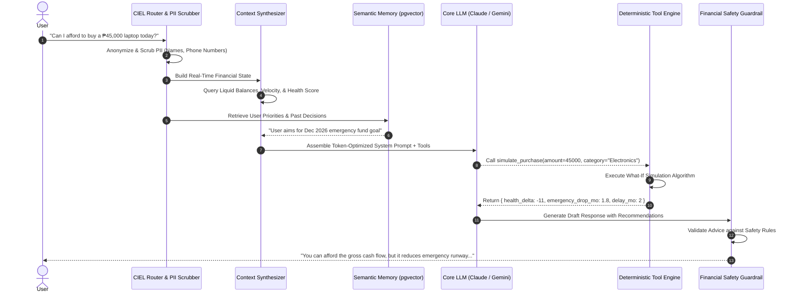

# AI Architecture — CIEL (Conversational Intelligent Economic Layer)

## 1. Architectural Philosophy

**CIEL** is not a generic, ungrounded conversational chatbot. It is designed as a **deterministic, tool-augmented Chief Financial Officer** that orchestrates Financial OS's mathematical engines.

```text
┌─────────────────────────────────────────────────────────────────────────┐
│                     THE CIEL DUAL-CORE PHILOSOPHY                       │
├───────────────────────────────────┬─────────────────────────────────────┤
│ 1. Deterministic Math Core        │ 2. Empathetic Cognitive Layer       │
├───────────────────────────────────┼─────────────────────────────────────┤
│ • Zero hallucination on numbers   │ • Natural language comprehension    │
│ • Calculation via backend engines │ • Contextual financial coaching     │
│ • Strict mathematical invariance  │ • Explains the "Why" behind metrics │
└───────────────────────────────────┴─────────────────────────────────────┘
```

---

## 2. Multi-Stage Pipeline Architecture



---

## 3. Deterministic Tool Execution Engine

CIEL is equipped with a formal suite of typed tool contracts:

### Tool Catalog

```python
from typing import Optional, List
from pydantic import BaseModel, Field

class SimulatePurchaseInput(BaseModel):
    amount: float = Field(..., description="Purchase cost in PHP")
    category: str = Field(..., description="Category: e.g., Electronics, Travel, Dining")
    payment_method: str = Field("cash", description="cash, credit_card_full, or installment_0pct")
    installment_months: Optional[int] = Field(None, description="Term in months if installment")

class SafeToSpendQuery(BaseModel):
    include_forecast_days: int = Field(7, description="Number of days to forecast daily allowance")

class ScamScanInput(BaseModel):
    message_text: str = Field(..., description="Raw SMS or chat text to evaluate")
    extracted_url: Optional[str] = Field(None, description="Extracted suspicious link if present")

class OLAComplaintInput(BaseModel):
    lender_name: str = Field(..., description="Name of the Online Lending App")
    violation_types: List[str] = Field(..., description="third_party_contact, public_shaming, off_hour_calls, threats")
    evidence_text: str = Field(..., description="Message transcripts or harassment notes")
```

---

## 4. Long-Term Semantic Memory & Vector Store

CIEL maintains long-term memory using PostgreSQL's `pgvector` extension:

```text
┌─────────────────────────────────────────────────────────────────────────┐
│                          CIEL MEMORY TIERS                              │
├───────────────────┬─────────────────────────────────────────────────────┤
│ 1. Working Memory │ In-session message history (last 10 turns)          │
│ 2. Financial State│ Real-time database metrics (balances, bills, score) │
│ 3. Semantic Memory│ Vector embeddings (text-embedding-3-small) of past  │
│                   │ decisions, explicit user goals, and life context    │
│ 4. Rules & Bounds │ Hardcoded financial guardrails (e.g., emergency     │
│                   │ fund must never drop below 1 month without warning) │
└───────────────────┴─────────────────────────────────────────────────────┘
```

### Memory Schema Representation

```sql
CREATE TABLE ciel_memories (
    id UUID PRIMARY KEY DEFAULT gen_random_uuid(),
    user_id UUID NOT NULL REFERENCES users(id) ON DELETE CASCADE,
    memory_type VARCHAR(50) NOT NULL, -- 'preference', 'goal_constraint', 'life_event'
    content TEXT NOT NULL,
    embedding vector(1536),
    importance_score FLOAT DEFAULT 1.0,
    created_at TIMESTAMP WITH TIME ZONE DEFAULT NOW(),
    last_accessed_at TIMESTAMP WITH TIME ZONE DEFAULT NOW()
);

CREATE INDEX idx_ciel_memories_embedding ON ciel_memories USING ivfflat (embedding vector_cosine_ops);
```

---

## 5. Token Optimization & PII Sanitization

1. **Structured Data Compression**: Account balances and recent transactions are serialized into token-efficient compact tabular text rather than verbose JSON.
2. **PII Redaction**: Regex engines automatically replace phone numbers (`09\d{9}`), credit card numbers, and full legal names with randomized anonymized tokens before passing to the LLM.
3. **Caching**: Common financial explanations (e.g., "How does Emergency Liquidity work?") are cached in Redis to minimize LLM compute costs and response latency.

---

## 6. Financial Safety & Sanity Guardrails

Before any response is delivered to the user, CIEL's Output Guardrail evaluates the text against safety directives:
* **Rule 1 (No Speculative Gambling)**: Never recommend high-risk crypto, speculative day-trading, or unregulated casino schemes.
* **Rule 2 (Mandatory Emergency Warnings)**: If a simulated purchase lowers emergency liquidity below 1.0 month, the output must explicitly flag a severe risk warning.
* **Rule 3 (Predatory Lending Rejection)**: If a user asks about high-interest unregistered lending apps, warn of predatory debt cycles and suggest formal alternatives.
* **Rule 4 (Mathematical Consistency)**: Verify that all numbers quoted in the response match the exact figures returned by tool executions.
