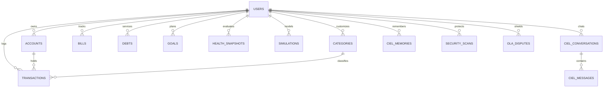

# Database Architecture & Data Model — Financial OS

## 1. Architectural Overview

Financial OS utilizes **PostgreSQL 16** as its primary relational datastore, augmented with **`pgvector`** for semantic AI memory and **monthly declarative partitioning** for the core transaction ledger.



---

## 2. Core Entity Schemas & DDL Definitions

### A. Identity & Multi-Account Ledger

```sql
-- 1. Users Table
CREATE TABLE users (
    id UUID PRIMARY KEY DEFAULT gen_random_uuid(),
    email VARCHAR(255) UNIQUE NOT NULL,
    hashed_password VARCHAR(255) NOT NULL,
    first_name VARCHAR(100) NOT NULL,
    last_name VARCHAR(100),
    currency VARCHAR(10) DEFAULT 'PHP',
    payday_frequency VARCHAR(50) DEFAULT 'semi_monthly', -- 'semi_monthly', 'monthly', 'weekly', 'irregular'
    payday_days INTEGER[] DEFAULT '{15, 30}',
    created_at TIMESTAMP WITH TIME ZONE DEFAULT NOW(),
    updated_at TIMESTAMP WITH TIME ZONE DEFAULT NOW()
);

-- 2. Accounts Table
CREATE TABLE accounts (
    id UUID PRIMARY KEY DEFAULT gen_random_uuid(),
    user_id UUID NOT NULL REFERENCES users(id) ON DELETE CASCADE,
    name VARCHAR(100) NOT NULL, -- e.g., 'BPI Payroll', 'GCash Main', 'GoTyme Savings'
    account_type VARCHAR(50) NOT NULL, -- 'cash', 'ewallet', 'digital_bank', 'traditional_bank', 'credit_card'
    institution VARCHAR(100) NOT NULL, -- 'BPI', 'GCash', 'Maya', 'GoTyme', 'UnionBank', 'Cash'
    current_balance NUMERIC(14, 2) NOT NULL DEFAULT 0.00,
    credit_limit NUMERIC(14, 2) DEFAULT NULL,
    is_liquid BOOLEAN NOT NULL DEFAULT TRUE,
    created_at TIMESTAMP WITH TIME ZONE DEFAULT NOW(),
    updated_at TIMESTAMP WITH TIME ZONE DEFAULT NOW()
);

-- 3. Categories Table
CREATE TABLE categories (
    id UUID PRIMARY KEY DEFAULT gen_random_uuid(),
    user_id UUID REFERENCES users(id) ON DELETE CASCADE, -- NULL for system defaults
    name VARCHAR(100) NOT NULL,
    icon VARCHAR(50) NOT NULL DEFAULT 'category',
    color_hex VARCHAR(20) NOT NULL DEFAULT '#3869D2',
    is_discretionary BOOLEAN NOT NULL DEFAULT TRUE,
    parent_id UUID REFERENCES categories(id) ON DELETE SET NULL,
    created_at TIMESTAMP WITH TIME ZONE DEFAULT NOW()
);

-- 4. Partitioned Transactions Ledger
CREATE TABLE transactions (
    id UUID DEFAULT gen_random_uuid(),
    user_id UUID NOT NULL REFERENCES users(id) ON DELETE CASCADE,
    account_id UUID NOT NULL REFERENCES accounts(id) ON DELETE CASCADE,
    category_id UUID REFERENCES categories(id) ON DELETE SET NULL,
    amount NUMERIC(14, 2) NOT NULL, -- Positive for Income, Negative for Expense
    transaction_type VARCHAR(20) NOT NULL, -- 'income', 'expense', 'transfer'
    merchant_name VARCHAR(150) NOT NULL,
    raw_description TEXT,
    transaction_date DATE NOT NULL,
    ingestion_source VARCHAR(50) NOT NULL, -- 'manual', 'sms', 'notification', 'ocr', 'csv'
    is_recurring BOOLEAN DEFAULT FALSE,
    receipt_url TEXT DEFAULT NULL,
    metadata JSONB DEFAULT '{}'::jsonb,
    created_at TIMESTAMP WITH TIME ZONE DEFAULT NOW(),
    PRIMARY KEY (id, transaction_date)
) PARTITION BY RANGE (transaction_date);

-- Example Monthly Partition Creation
CREATE TABLE transactions_2026_01 PARTITION OF transactions
    FOR VALUES FROM ('2026-01-01') TO ('2026-02-01');
CREATE TABLE transactions_2026_02 PARTITION OF transactions
    FOR VALUES FROM ('2026-02-01') TO ('2026-03-01');
CREATE TABLE transactions_2026_03 PARTITION OF transactions
    FOR VALUES FROM ('2026-03-01') TO ('2026-04-01');
```

---

### B. Planning, Health & Simulation Entities

```sql
-- 5. Recurring Bills & Subscriptions
CREATE TABLE bills (
    id UUID PRIMARY KEY DEFAULT gen_random_uuid(),
    user_id UUID NOT NULL REFERENCES users(id) ON DELETE CASCADE,
    category_id UUID REFERENCES categories(id) ON DELETE SET NULL,
    name VARCHAR(150) NOT NULL, -- e.g., 'Meralco Electricity', 'Converge Internet'
    expected_amount NUMERIC(14, 2) NOT NULL,
    due_day INTEGER NOT NULL, -- Day of the month (1-31)
    is_auto_debit BOOLEAN DEFAULT FALSE,
    is_active BOOLEAN DEFAULT TRUE,
    created_at TIMESTAMP WITH TIME ZONE DEFAULT NOW()
);

-- 6. Debts & Amortization
CREATE TABLE debts (
    id UUID PRIMARY KEY DEFAULT gen_random_uuid(),
    user_id UUID NOT NULL REFERENCES users(id) ON DELETE CASCADE,
    name VARCHAR(150) NOT NULL, -- e.g., 'UnionBank CC Outstanding', 'Auto Loan'
    total_principal NUMERIC(14, 2) NOT NULL,
    remaining_balance NUMERIC(14, 2) NOT NULL,
    interest_rate_annual NUMERIC(5, 2) NOT NULL DEFAULT 0.00,
    minimum_monthly_payment NUMERIC(14, 2) NOT NULL,
    due_date DATE,
    created_at TIMESTAMP WITH TIME ZONE DEFAULT NOW()
);

-- 7. Adaptive Goals
CREATE TABLE goals (
    id UUID PRIMARY KEY DEFAULT gen_random_uuid(),
    user_id UUID NOT NULL REFERENCES users(id) ON DELETE CASCADE,
    name VARCHAR(150) NOT NULL, -- e.g., 'Emergency Fund', 'New Laptop', 'Japan 2026'
    target_amount NUMERIC(14, 2) NOT NULL,
    current_amount NUMERIC(14, 2) NOT NULL DEFAULT 0.00,
    target_date DATE NOT NULL,
    priority_tier INTEGER NOT NULL DEFAULT 3, -- 1: Emergency, 2: Debt, 3: Sinking, 4: Aspirational
    recommended_monthly_contribution NUMERIC(14, 2) NOT NULL,
    created_at TIMESTAMP WITH TIME ZONE DEFAULT NOW()
);

-- 8. Financial Health Historical Snapshots
CREATE TABLE health_snapshots (
    id UUID PRIMARY KEY DEFAULT gen_random_uuid(),
    user_id UUID NOT NULL REFERENCES users(id) ON DELETE CASCADE,
    composite_score INTEGER NOT NULL, -- 0 to 100
    cashflow_resiliency_score INTEGER NOT NULL, -- 0 to 100
    emergency_liquidity_score INTEGER NOT NULL, -- 0 to 100
    debt_ratio_score INTEGER NOT NULL, -- 0 to 100
    savings_consistency_score INTEGER NOT NULL, -- 0 to 100
    discretionary_restraint_score INTEGER NOT NULL, -- 0 to 100
    emergency_months_covered NUMERIC(5, 2) NOT NULL,
    safe_to_spend_at_snapshot NUMERIC(14, 2) NOT NULL,
    contextual_summary TEXT,
    snapshot_date DATE NOT NULL DEFAULT CURRENT_DATE
);
```

---

### C. CIEL Memory & Security Entities

```sql
-- 9. CIEL Conversation Sessions & Messages
CREATE TABLE ciel_conversations (
    id UUID PRIMARY KEY DEFAULT gen_random_uuid(),
    user_id UUID NOT NULL REFERENCES users(id) ON DELETE CASCADE,
    title VARCHAR(150) DEFAULT 'Financial Advisory',
    created_at TIMESTAMP WITH TIME ZONE DEFAULT NOW(),
    updated_at TIMESTAMP WITH TIME ZONE DEFAULT NOW()
);

CREATE TABLE ciel_messages (
    id UUID PRIMARY KEY DEFAULT gen_random_uuid(),
    conversation_id UUID NOT NULL REFERENCES ciel_conversations(id) ON DELETE CASCADE,
    sender VARCHAR(20) NOT NULL, -- 'user' or 'ciel'
    content TEXT NOT NULL,
    tool_invocations JSONB DEFAULT NULL,
    created_at TIMESTAMP WITH TIME ZONE DEFAULT NOW()
);

-- 10. Scam Scans & Threat Records
CREATE TABLE security_scans (
    id UUID PRIMARY KEY DEFAULT gen_random_uuid(),
    user_id UUID NOT NULL REFERENCES users(id) ON DELETE CASCADE,
    raw_content_preview VARCHAR(255),
    scam_probability INTEGER NOT NULL, -- 0 to 100
    threat_level VARCHAR(20) NOT NULL, -- 'safe', 'suspicious', 'critical'
    detected_patterns TEXT[],
    created_at TIMESTAMP WITH TIME ZONE DEFAULT NOW()
);

-- 11. OLA Harassment Case Files
CREATE TABLE ola_disputes (
    id UUID PRIMARY KEY DEFAULT gen_random_uuid(),
    user_id UUID NOT NULL REFERENCES users(id) ON DELETE CASCADE,
    lender_name VARCHAR(150) NOT NULL,
    violations_detected TEXT[] NOT NULL,
    generated_affidavit_url TEXT,
    status VARCHAR(50) DEFAULT 'drafted', -- 'drafted', 'filed_bsp', 'resolved'
    created_at TIMESTAMP WITH TIME ZONE DEFAULT NOW()
);
```

---

## 3. Row-Level Security (RLS) Multi-Tenant Policies

To guarantee that no user or process can ever access another user's financial ledger:

```sql
ALTER TABLE accounts ENABLE ROW LEVEL SECURITY;
ALTER TABLE transactions ENABLE ROW LEVEL SECURITY;
ALTER TABLE bills ENABLE ROW LEVEL SECURITY;
ALTER TABLE goals ENABLE ROW LEVEL SECURITY;
ALTER TABLE health_snapshots ENABLE ROW LEVEL SECURITY;
ALTER TABLE ciel_conversations ENABLE ROW LEVEL SECURITY;

-- Dynamic Tenant Isolation Policy
CREATE POLICY user_tenant_isolation_accounts ON accounts
    FOR ALL
    USING (user_id = current_setting('app.current_user_id', true)::uuid);

CREATE POLICY user_tenant_isolation_transactions ON transactions
    FOR ALL
    USING (user_id = current_setting('app.current_user_id', true)::uuid);
```

---

## 4. Indexing & Query Optimization Strategy

1. **Transaction Aggregation Index**:
   ```sql
   CREATE INDEX idx_transactions_user_date ON transactions (user_id, transaction_date DESC);
   CREATE INDEX idx_transactions_category ON transactions (user_id, category_id);
   ```
2. **Account Balance Lookup Index**:
   ```sql
   CREATE INDEX idx_accounts_user_liquid ON accounts (user_id, is_liquid);
   ```
3. **pgvector Approximate Nearest Neighbor (ANN) Index**:
   ```sql
   CREATE INDEX idx_ciel_memories_ann ON ciel_memories USING hnsw (embedding vector_cosine_ops);
   ```
