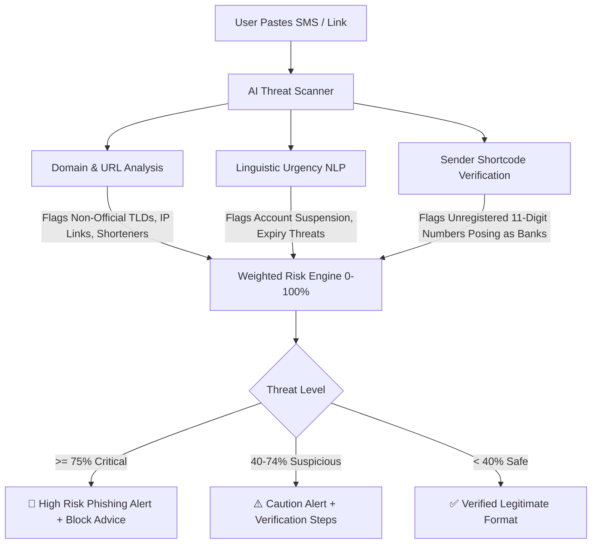

# Security, Privacy & Legal Protection Blueprint — Financial OS

## 1. The Zero-Credential Security Paradigm

The fundamental security premise of Financial OS is **Zero Credential Custody**. While Western applications require users to input bank usernames and passwords through third-party scrapers (e.g., Plaid, MX), Financial OS is engineered to operate without ever handling institutional bank credentials.

```text
┌─────────────────────────────────────────────────────────────────────────┐
│               TRADITIONAL AGGREGATOR VS FINANCIAL OS                   │
├───────────────────────────────────┬─────────────────────────────────────┤
│ Legacy Aggregators (Plaid/Yodlee) │ Financial OS Architecture           │
├───────────────────────────────────┼─────────────────────────────────────┤
│ ❌ Stores bank passwords & tokens │ ✅ NEVER requests bank credentials │
│ ❌ Server-side financial pulling  │ ✅ Client-side SMS & Receipt parsing│
│ ❌ High target for hackers/breach │ ✅ Zero-knowledge encrypted storage │
│ ❌ Violates PH Bank Secrecy Law   │ ✅ Fully compliant with RA 10173    │
└───────────────────────────────────┴─────────────────────────────────────┘
```

---

## 2. Philippine Legal & Regulatory Compliance

### A. Data Privacy Act of 2012 (Republic Act No. 10173)
* **Principle of Proportionality**: Financial OS collects only data strictly necessary for computing financial metrics.
* **Client-Side Edge Sanitization**: Personally Identifiable Information (PII) including real names, phone numbers (`09xxxxxxxxx`), and account numbers are sanitized at the client level before sending anonymized payloads to LLM endpoints.
* **Right to Erasure (Data Sovereignty)**: Users have 1-click full database purge capabilities, permanently deleting all stored ledger entries, accounts, and chat memories.

### B. Bank Secrecy Law (Republic Act No. 1405) & E-Commerce Act (RA 8792)
* Financial OS does not act as a custodial intermediary, payment switch, or account scraper. Users maintain 100% legal ownership of their declared records and imported statements.

---

## 3. Proactive AI Scam & Phishing Radar

The Scam Radar analyzes suspicious SMS messages, emails, and links shared by the user to prevent digital wallet drain before it occurs.



### Heuristic Rule Set
1. **Urgency Linguistic Marker**: Detecting panic triggers (*"account will be permanently disabled in 24 hours"*, *"unauthorized login detected click here immediately"*).
2. **Domain Spoofing Check**: Checking domain character mutations (e.g., `g-cash.xyz`, `bpi-online-security.net` vs `gcash.com`, `bpi.com.ph`).
3. **Sender Origin Flag**: Flagging regular 11-digit mobile numbers sending institutional bank notifications.

---

## 4. Predatory OLA Harassment Shield & Legal Complaint Generator

Predatory Online Lending Apps (OLAs) systematically violate Philippine consumer laws by accessing borrower contact lists, posting public shame messages, and utilizing threats of violence. Financial OS provides an automated legal shield.

```text
┌─────────────────────────────────────────────────────────────────────────┐
│                      OLA LEGAL HARASSMENT SHIELD                        │
├─────────────────────────────────────────────────────────────────────────┤
│ 1. INGESTION: User uploads abusive SMS transcripts or collection chats  │
│ 2. CLASSIFICATION: Classifier maps violations against Philippine laws:  │
│    • SEC Memorandum Circular No. 18 (Series of 2019)                   │
│    • NPC Circular No. 20-01 (Data Privacy Violations)                  │
│    • Revised Penal Code Art. 282/283 (Grave Threats & Coercion)        │
│ 3. LEGAL DRAFTING: Engine generates a formal, pre-populated Legal       │
│    Affidavit / Complaint Form formatted specifically for:               │
│    • Bangko Sentral ng Pilipinas (BSP) - BOB Chatbot Grievance        │
│    • Securities & Exchange Commission (SEC) - EIPD Enforcement Dept    │
│    • National Privacy Commission (NPC) - Complaints and Investigation   │
└─────────────────────────────────────────────────────────────────────────┘
```

### Statutory Violations Detected by OLA Shield

| Legal Violation | Governing Statute | Penalty / Regulatory Action |
| :--- | :--- | :--- |
| **Contacting Non-Guarantor Friends & Family** | SEC MC No. 18, Sec. 1(a); RA 10173 | Revocation of Lending License, Criminal Data Privacy Fines |
| **Public Shaming / Social Media Harassment** | SEC MC No. 18, Sec. 1(c); Cybercrime Act | Criminal Cyber-Libel & Unjust Vexation Charges |
| **Calling Before 6:00 AM or After 10:00 PM** | SEC MC No. 18, Sec. 1(d) | Regulatory Sanctions & Administrative Fines |
| **Threats of Violence or False Legal Arrest** | Revised Penal Code Art. 282/287 | Criminal Imprisonment for Grave Coercion / Grave Threats |

---

## 5. Cryptographic Security Standards

* **Data in Transit**: TLS 1.3 encryption with strict HTTP Strict Transport Security (HSTS) headers.
* **Data at Rest**: AES-256 field-level encryption for user identifiers and financial notes.
* **Key Management**: Master user encryption keys derived using PBKDF2 with SHA-256 and salt, ensuring that backend database administrators cannot read raw user notes without the user's master session key.
