# System Architecture Blueprint — Financial OS

## 1. High-Level Architecture Overview

Financial OS is architected as a modern, decoupled, multi-tier distributed system optimized for low latency, zero-knowledge privacy, high mathematical precision, and resilient AI tool orchestration.

```mermaid
graph TD
    subgraph Client Presentation Layer
        Web[Next.js 14 Web App<br/>SSR + React Server Components]
        Mobile[Capacitor / PWA Mobile Client<br/>Local SQLite + SMS Listener]
        WebWorker[Client-Side Web Workers<br/>Local OCR & Regex Parsing]
    end

    subgraph API Gateway & Service Layer
        Gateway[FastAPI Async Gateway<br/>Uvicorn / Python 3.11+]
        AuthSvc[Auth & Master Key Service<br/>JWT + Zero-Credential Keystore]
        RateLimiter[Redis Token-Bucket Rate Limiter]
    end

    subgraph Deterministic Core Engines
        HealthEngine[Financial Health Engine<br/>5-Pillar Score 0-100]
        SpendEngine[Safe-to-Spend Engine<br/>Real-Time Daily Allowance]
        SimEngine[What-If Simulation Engine<br/>Multi-Scenario Matrix]
        VelocityEngine[Spending Velocity & Forecast]
    end

    subgraph Ambient Data Ingestion Pipeline
        SMSParser[SMS Alert Parser]
        NotifParser[Wallet Push Ingestor]
        OCRService[Receipt Vision OCR Engine]
        CSVStream[Streaming CSV Importer]
    end

    subgraph AI Intelligence & Security Layer
        CIEL[CIEL AI Copilot<br/>Tool Calling & Context Assembler]
        ScamRadar[AI Scam & Phishing Radar]
        OLAShield[OLA Harassment Legal Generator]
        MemoryBank[pgvector Semantic Memory]
    end

    subgraph Data & Persistence Tier
        Postgres[(PostgreSQL 16<br/>RLS + pgvector + Partitioning)]
        Redis[(Redis 7 Cluster<br/>Cache + Celery Broker)]
        CeleryWorkers[Celery Async Task Workers]
    end

    Web --> Gateway
    Mobile --> Gateway
    WebWorker --> Gateway

    Gateway --> AuthSvc
    Gateway --> RateLimiter

    Gateway --> HealthEngine
    Gateway --> SpendEngine
    Gateway --> SimEngine
    Gateway --> VelocityEngine

    Gateway --> SMSParser
    Gateway --> NotifParser
    Gateway --> OCRService
    Gateway --> CSVStream

    Gateway --> CIEL
    Gateway --> ScamRadar
    Gateway --> OLAShield

    CIEL --> HealthEngine
    CIEL --> SpendEngine
    CIEL --> SimEngine
    CIEL --> MemoryBank

    Gateway --> Postgres
    Gateway --> Redis
    Redis --> CeleryWorkers
    CeleryWorkers --> Postgres
```



---

## 2. Layer-by-Layer Technical Specification

### A. Presentation Layer (Web & Mobile)
* **Framework**: Next.js 14 (App Router), React 18, TypeScript 5.
* **Styling & Motion**: Tailwind CSS v3, Vanilla CSS Design System (`globals.css`), CSS 3D Transforms, `requestAnimationFrame` 60fps spring physics loop.
* **State Management**: Zustand for lightweight local application state, TanStack React Query for async server cache synchronization.
* **Client-Side Processing**: Web Workers for executing local receipt OCR (Tesseract.js) and SMS regex parsing on-device before syncing to the cloud, ensuring maximum user privacy.

---

### B. API Gateway & Micro-Engine Layer (Backend)
* **Framework**: FastAPI (Python 3.11+), Pydantic v2 for strict type validation and OpenAPI 3.1 contract generation.
* **Concurrency Model**: Asynchronous ASGI server (Uvicorn), utilizing `asyncio` and `asyncpg` for non-blocking I/O.
* **Design Pattern**: Dependency Injection pattern with modular service boundaries (`core/`, `engines/`, `ai/`, `ingestion/`, `security/`).

---

### C. Deterministic Calculation Engines
To ensure 100% financial accuracy and prevent LLM hallucination, all core metrics are computed by deterministic mathematical engines:
1. **Financial Health Engine**: Evaluates Cash Flow Resiliency (30%), Emergency Liquidity (25%), Debt-to-Income (20%), Savings Consistency (15%), and Discretionary Restraint (10%).
2. **Safe-to-Spend Engine**: Computes daily spendable envelope after sequestering recurring bills, debt minimums, goal allocations, and safety buffers.
3. **What-If Simulation Engine**: Computes prospective multi-scenario balance sheets (e.g., Cash vs Installment vs Deferred).
4. **Velocity Engine**: Real-time spending pace comparisons against historical moving averages.

---

### D. Ambient Ingestion Pipeline
* **SMS Ingestion Service**: Localized regex engine identifying transaction patterns from GCash, Maya, BPI, UnionBank, BDO, RCBC, Security Bank, and GrabPay.
* **Receipt OCR Service**: Multi-stage document normalizer using adaptive thresholding, OpenCV pre-processing, and Tesseract/Vision LLM extraction.
* **CSV Stream Processor**: Streaming parser supporting bank-specific statement templates with automatic column inference and transaction deduplication (hash-based UUID v5).

---

### E. AI Intelligence & Security Layer
* **CIEL AI Orchestrator**: Multi-stage pipeline comprising Context Synthesis, System Prompt Assembly, Function Calling/Tool Router, and Safety Guardrails.
* **Scam & Phishing Radar**: Multi-factor URL entropy analyzer, sender shortcode validator, and NLP urgency classifier.
* **OLA Harassment Shield**: Rule-based legal classifier mapping debt collection tactics against SEC Memorandum Circular No. 18 and Data Privacy Act (RA 10173), dynamically generating formal legal complaint PDFs.

---

### F. Data & Persistence Layer
* **Primary Database**: PostgreSQL 16 with Row-Level Security (RLS), JSONB indexing, monthly partition tables for historical ledger transactions, and `pgvector` for semantic search.
* **Cache & Message Broker**: Redis 7 for sub-millisecond session state, token-bucket rate limiting, and Celery background task queue management.
* **Async Workers**: Celery workers handling periodic daily morning briefing synthesis, heavy OCR processing, and historical snapshot generation.

---

## 3. Data Flow & Zero-Credential Privacy Guarantees

```text
┌─────────────────────────────────────────────────────────────────────────┐
│                      ZERO-CREDENTIAL PRIVACY FLOW                       │
├─────────────────────────────────────────────────────────────────────────┤
│ 1. User NEVER provides bank credentials, passwords, or OTPs.            │
│ 2. Ingestion artifacts (SMS texts, receipts) are parsed locally on the  │
│    client device whenever possible.                                     │
│ 3. PII (Names, Account Numbers, Phone Numbers) is automatically scrubbed│
│    and anonymized prior to any external LLM tool calls.                 │
│ 4. Transaction data is stored in tenant-isolated PostgreSQL tables      │
│    enforced via strict Row-Level Security (RLS) policies.               │
└─────────────────────────────────────────────────────────────────────────┘
```

---

## 4. Scalability & Deployment Topology

* **Containerization**: Multi-stage Docker containers with lightweight Alpine Linux base images.
* **Orchestration**: Docker Compose for local development; Kubernetes (EKS/GKE) or Fly.io/Render for cloud production clusters.
* **Monitoring & Observability**: Structured JSON logging via Loguru, Prometheus metrics exporter, and Sentry error tracking.
