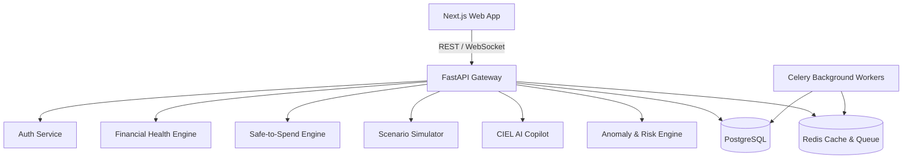

# System Architecture - Financial OS

```mermaid
graph TD
    Client[Next.js Web App] -->|REST / WebSocket| API[FastAPI Gateway]
    API --> Auth[Auth Service]
    API --> HealthEngine[Financial Health Engine]
    API --> SpendEngine[Safe-to-Spend Engine]
    API --> SimEngine[Scenario Simulator]
    API --> CIEL[CIEL AI Copilot]
    API --> SecurityEngine[Anomaly & Risk Engine]
    
    API --> DB[(PostgreSQL)]
    API --> Cache[(Redis Cache & Queue)]
    Workers[Celery Background Workers] --> DB
    Workers --> Cache
```
