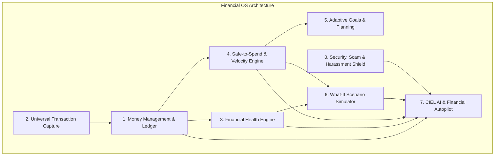

# Product Requirement Document (PRD) — Financial OS

## 1. Executive Summary & Product Vision

**Financial OS** is an intelligent, privacy-first **Financial Decision Operating System** engineered specifically for the realities of the modern digital economy. Rather than functioning as a passive, backward-looking expense tracker, Financial OS shifts personal finance into **prescriptive, real-time intelligence**.

```text
┌─────────────────────────────────────────────────────────────────────────┐
│                          CORE PRODUCT IDENTITY                          │
├─────────────────────────────────────────────────────────────────────────┤
│            TRACK  ──►  UNDERSTAND  ──►  PREDICT  ──►  DECIDE            │
│                                                                         │
│  • Zero bank credentials required (100% user-controlled data)           │
│  • Ambient transaction capture (SMS, Push Notifications, OCR, CSV)      │
│  • Prescriptive Safe-to-Spend daily allowance calculation               │
│  • Dynamic Financial Health Engine (0–100 weighted score)               │
│  • Forward-looking "What-If" Purchase & Scenario Simulator              │
│  • CIEL (Conversational Intelligent Economic Layer) as personal AI CFO  │
│  • Integrated Scam Radar & OLA Harassment Legal Shield                  │
└─────────────────────────────────────────────────────────────────────────┘
```

---

## 2. Target Demographics & User Personas

1. **Young Urban Professionals (22–30 yrs)**: Steady income across digital wallets, experiencing high cost-of-living anxiety and paycheck-to-paycheck volatility.
2. **Remote Freelancers & Gig Workers (23–35 yrs)**: Irregular, multi-currency cash flows (Wise, PayPal, GCash, Maya) needing dynamic cash flow smoothing and adaptive tax/savings targets.
3. **Young Household Planners (28–38 yrs)**: Juggling utility bills, rent/mortgage, insurance, and childcare who require unified recurring bill sequestration and anomaly detection.

---

## 3. The 8 Major Architectural Systems



---

### System 1: Money Management & Double-Entry Ledger

* **Multi-Account Aggregation**: Supports Cash, E-Wallets (GCash, Maya, GrabPay), Digital Banks (GoTyme, Seabank, CIMB), Traditional Checking/Savings (BPI, UnionBank, BDO), and Credit Cards.
* **Smart Auto-Categorization**: On-device machine learning parser mapping transaction strings to localized taxons:
  * Food & Dining (e.g., Jollibee, GrabFood, Foodpanda)
  * Transportation (e.g., GrabCar, Angkas, JoyRide, MRT/LRT)
  * Utilities & Housing (e.g., Meralco, Maynilad, Converge, Condo Dues)
  * Entertainment & Subscriptions (e.g., Netflix, Spotify, Steam)
  * Healthcare, Shopping, Debt Service, Income/Transfers.
* **Transaction Enrichment**: Notes, merchant clean names, recurring flags, geolocation tags, and receipt attachment links.

---

### System 2: Universal Ambient Transaction Capture

A signature differentiator eliminating manual logging fatigue without requiring banking APIs:

```text
┌─────────────────┐     ┌─────────────────────────────────────────────────┐
│ Ingestion Mode  │     │ Processing Flow                                 │
├─────────────────┼─────┼─────────────────────────────────────────────────┤
│ 1. SMS Alerts   │ ──► │ Local Regex/NLP extracts Amount, Merchant, Date │
│ 2. Notifications│ ──► │ Push listener captures wallet transactions      │
│ 3. Receipt OCR  │ ──► │ Vision model extracts line-item totals & vendor │
│ 4. CSV Import   │ ──► │ Column mapping, normalization & deduplication   │
│ 5. Quick Add    │ ──► │ Floating 1-tap manual modal                     │
└─────────────────┘     └─────────────────────────────────────────────────┘
```

---

### System 3: Financial Health Engine & "Why?" Explanation System

A proprietary 0–100 composite index calculated across 5 weighted macroeconomic pillars:

$$\text{Health Score} = 0.30(C) + 0.25(E) + 0.20(D) + 0.15(S) + 0.10(R)$$

| Pillar | Weight | Metric Definition | Target Benchmark |
| :--- | :--- | :--- | :--- |
| **Cash Flow Resiliency ($C$)** | 30% | Net Cash Flow ratio vs total monthly income | Net positive > 20% |
| **Emergency Liquidity ($E$)** | 25% | Months of essential living expenses saved | 3.0 to 6.0 months |
| **Debt-to-Income Ratio ($D$)** | 20% | Monthly debt servicing costs vs gross income | $< 25\%$ of income |
| **Savings Consistency ($S$)** | 15% | Adherence to monthly adaptive savings targets | $\ge 90\%$ adherence |
| **Discretionary Restraint ($R$)** | 10% | Variance against 3-month trailing spend average | $\le \pm 5\%$ variance |

* **Contextual "Why?" Attribution**: Every score change is accompanied by natural language drivers:
  * *"Your score dropped 4 points because dining out increased 24%, reducing cash flow resiliency."*
  * *"Emergency fund increased to 2.1 months (+6 points)."*

---

### System 4: Safe-to-Spend & Spending Velocity Engine

Calculates true daily purchasing power rather than displaying deceptive lump-sum account balances:

$$\text{Safe-to-Spend}_{\text{Today}} = \frac{\text{Available Liquid Balances} - \text{Upcoming Bills}_{\text{Cycle}} - \text{Debt Obligations} - \text{Target Savings} - \text{Min Reserve}}{\text{Days Remaining in Cycle}}$$

* **Velocity Tracker**: Compares real-time spending pace against historical burn rates:
  $$\text{Spending Velocity} = \frac{\text{Actual Spend to Date}}{\text{Expected Spend to Date}}$$
  * Alerts user if spending velocity exceeds $1.15\times$ historical average.
* **End-of-Month Forecast**: Predicts projected closing balances, expected savings rate, and cash depletion risks before paydays.

---

### System 5: Adaptive Goals & Dynamic Savings

* **Non-Linear Goal Engine**: Abandons rigid fixed-monthly deductions. When cash flow is high, contributions dynamically accelerate; during high-utility months, targets soften to protect liquidity.
* **Goal Prioritization Hierarchy**:
  1. *Tier 1: Emergency Fund (1–3 months baseline)*
  2. *Tier 2: High-Interest Debt Amortization*
  3. *Tier 3: Mid-Term Sinking Funds (Tuition, Insurance, Appliances)*
  4. *Tier 4: Long-Term Aspirations (Travel, Investments, Down Payments)*

---

### System 6: "What-If" Purchase & Decision Simulator

Provides instant sandbox modeling for major financial decisions before committing funds:

```text
USER QUERY: "What if I buy a ₱60,000 laptop today?"

SIMULATOR OUTPUT:
┌─────────────────────────┬──────────────┬──────────────┬─────────────────┐
│ Metric                  │ Current      │ Post-Purchase│ Delta / Impact  │
├─────────────────────────┼──────────────┼──────────────┼─────────────────┤
│ Financial Health Score  │ 82 / 100     │ 69 / 100     │ ▼ -13 pts       │
│ Liquid Savings          │ ₱70,000      │ ₱10,000      │ ▼ -₱60,000      │
│ Emergency Coverage      │ 3.2 months   │ 0.7 months   │ ⚠️ CRITICAL LOW │
│ 'December Vacation' Goal│ On Track     │ Delayed      │ +4 months delay │
└─────────────────────────┴──────────────┴──────────────┴─────────────────┘
RECOMMENDATION: "Wait 3 months to save ₱20,000 buffer, OR utilize a 0% 12-month installment plan (₱5,000/mo) to preserve emergency runway."
```

---

### System 7: CIEL (Conversational Intelligent Economic Layer) & Autopilot

* **Deterministic Tool Execution**: CIEL is strictly grounded by calling backend mathematical engines:
  * `get_financial_health()`
  * `get_safe_to_spend()`
  * `simulate_purchase(amount, terms)`
  * `analyze_spending_velocity()`
  * `get_upcoming_bills()`
* **Daily Morning Briefing**: Automated 8:00 AM push summary: Safe-to-Spend today, bills due within 72 hours, goal pace, and contextual recommendations.
* **Financial Memory Bank**: Retains user financial goals, lifestyle priorities, and constraints to tailor future advisory.

---

### System 8: Proactive Security, Scam Radar & OLA Harassment Shield

1. **AI Scam & Phishing Radar**:
   * Scans SMS texts, sender shortcodes, and suspicious links.
   * Detects urgency markers, spoofed e-wallet domains, and credential harvesting patterns.
2. **Predatory OLA Harassment Shield**:
   * Analyzes debt collection messages for violations of SEC MC No. 18 and Data Privacy Act RA 10173 (unauthorized third-party contact, threats, public shaming, off-hour calling).
   * Generates formatted legal complaints ready for filing with the BSP Consumer Assistance Mechanism and SEC Enforcement and Investor Protection Department (EIPD).

---

## 4. Technical Non-Functional Requirements

| Dimension | Specification |
| :--- | :--- |
| **Privacy & Security** | Zero storage of banking credentials. AES-256 encryption at rest, TLS 1.3 in transit. Full compliance with RA 10173 (Data Privacy Act of 2012). |
| **Response Latency** | Engine calculations (Health, Safe-to-Spend) $< 50\text{ ms}$; CIEL conversational responses $< 1.5\text{ s}$ TTFT (Time-to-First-Token). |
| **Mobile & Offline** | Local SQLite client cache with offline transaction queuing and sync capabilities. |
| **Reliability** | 99.9% uptime SLA on API gateway; deterministic math tests covering 100% of financial formulas. |

---

## 5. Success Metrics & Key Performance Indicators (KPIs)

* **Engagement**: D1 $\ge 65\%$, D7 $\ge 45\%$, D30 $\ge 35\%$ active retention.
* **Habit Retention**: Reduction in expense-tracking abandonment from industry average 80% to $< 25\%$ within 30 days.
* **Financial Efficacy**: Average user financial health score increase of $+8\text{ points}$ within 90 days.
* **Security Impact**: $> 95\%$ accuracy in phishing link detection and OLA violation classification.
