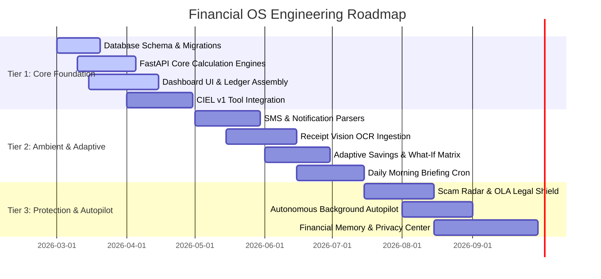

# Product Roadmap & Phased Implementation — Financial OS

## 1. Strategic Roadmap Overview

To mitigate product bloat and maintain disciplined execution, the development of Financial OS follows an **8-Phase Research-to-Execution Framework** aligned with a **3-Tier Feature Hierarchy**.

```text
┌─────────────────────────────────────────────────────────────────────────┐
│                      FINANCIAL OS EXECUTION PHASING                     │
├─────────────────────────────────────────────────────────────────────────┤
│  PHASE 1–4: Foundational Research, Mining & User Interviews (COMPLETED) │
│  PHASE 5–6: Quantitative Validation & Feature Prioritization (CURRENT)  │
│  PHASE 7–8: Core Engine Development, CIEL & Closed Beta (IN PROGRESS)   │
└─────────────────────────────────────────────────────────────────────────┘
```

---

## 2. Feature Release Tiers

### 🔴 Tier 1: Core Foundation & MVP (Q1–Q2)
*Goal: Build the bedrock ledger, privacy-first ingestion, deterministic calculation engines, and interactive visual interface.*

- [x] **Monorepo Architecture & Modern UI Shell**: Next.js 14, Tailwind CSS, 3D interactive credit card, and dark glassmorphic layout.
- [x] **Zero-Credential Authentication & Setup**: Local session management with end-to-end data encryption.
- [ ] **Multi-Account Double-Entry Ledger**: Accounts, manual transactions, categories, and transfer reconciliation.
- [ ] **Financial Health Engine (v1.0)**: Composite 0–100 score calculating Cash Flow Resiliency, Emergency Liquidity, and Debt Ratios.
- [ ] **Real-Time Safe-to-Spend Engine**: Daily purchasing limit calculator with cycle bill sequestration.
- [ ] **Basic What-If Purchase Simulator**: Single-scenario purchase impact on liquidity and emergency fund.
- [ ] **CIEL AI Copilot (Core Tools)**: Deterministic tool execution for balances, health score, and basic advice.
- [ ] **CSV & Manual Fast Ingestion**: Clean importer with automatic column mapping and deduplication.

---

### 🟡 Tier 2: Differentiators & Ambient Automation (Q2–Q3)
*Goal: Automate data capture, introduce dynamic fluidity to savings, and activate proactive threat detection.*

- [ ] **Ambient SMS & Notification Parser**: On-device regex & local NLP models for GCash, Maya, BPI, and UnionBank alerts.
- [ ] **Client-Side Receipt OCR**: Edge document scanning extracting merchant, date, tax, and line items.
- [ ] **Adaptive Savings Engine**: Non-linear monthly contribution recommendations adjusting dynamically to cash flow velocity.
- [ ] **Spending Velocity & End-of-Month Predictor**: Real-time burn rate comparisons against historical baselines.
- [ ] **Multi-Scenario Comparison Sandbox**: Side-by-side What-If matrix (Buy Now vs Wait vs Installment).
- [ ] **CIEL Daily Morning Briefing**: Automated daily 8:00 AM synthesized financial briefings.
- [ ] **Recurring Expense & Subscription Detector**: Automated detection of subscription creep, price jumps, and billing cycles.

---

### 🟢 Tier 3: Advanced Intelligence & Ecosystem Moats (Q3–Q4)
*Goal: Deepen long-term financial memory, autonomous protective guardrails, and regulatory legal automation.*

- [ ] **AI Scam & Phishing Radar**: Multi-factor phishing link analysis and urgency language detection.
- [ ] **Predatory OLA Harassment Shield**: Statutory violation classifier and automated legal complaint affidavit generator (BSP BOB / SEC EIPD).
- [ ] **Financial Memory Bank**: Long-term semantic memory for CIEL regarding user life milestones and risk preferences.
- [ ] **Autonomous Financial Autopilot**: Background anomaly detection for unexpected charges, low cash warnings, and milestone celebrations.
- [ ] **Historical Financial Timeline & Badges**: Long-term net worth milestone tracking without stressful gamification streaks.
- [ ] **Privacy Center & Data Sovereignty Hub**: 1-click local export, selective audit log purges, and encrypted backup snapshots.

---

## 3. Engineering Milestones & Deliverables



---

## 4. Key Performance Milestones

1. **Alpha Milestone (End of Month 1)**: Internal dogfooding of ledger, Safe-to-Spend engine, and basic CIEL chat interface.
2. **Closed Beta Milestone (End of Month 3)**: 100-user closed beta with SMS parsing, What-If simulator, and Financial Health scoring.
3. **Public Launch Milestone (End of Month 6)**: Production release across Web and Mobile with full Security & OLA shield suite.
