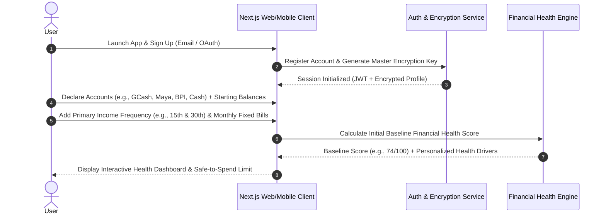
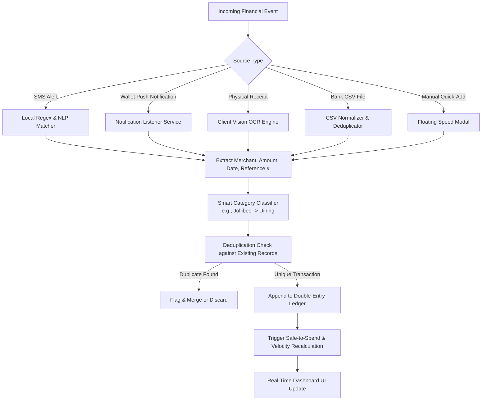
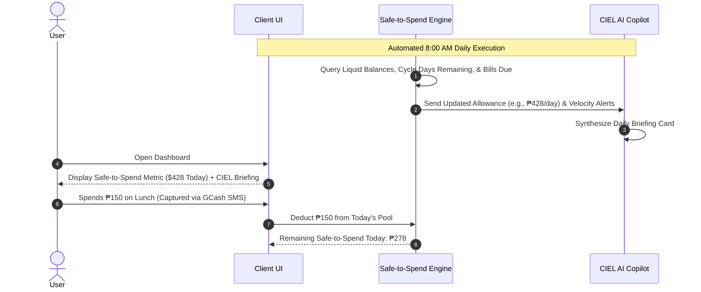
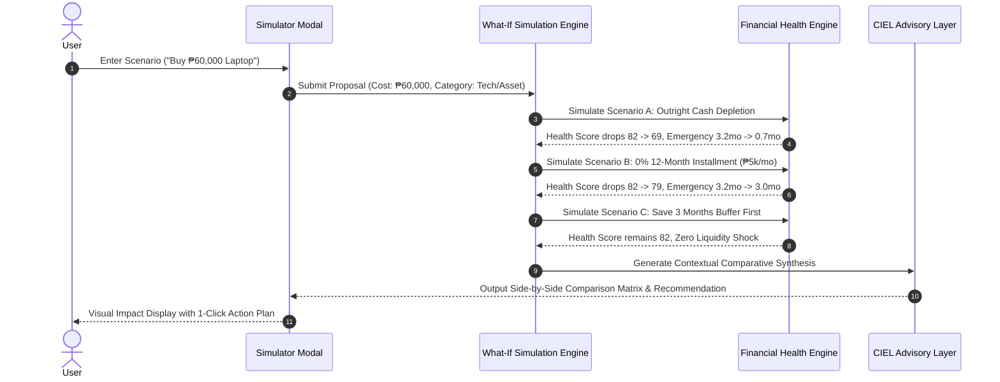
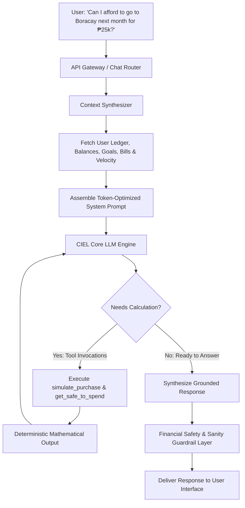
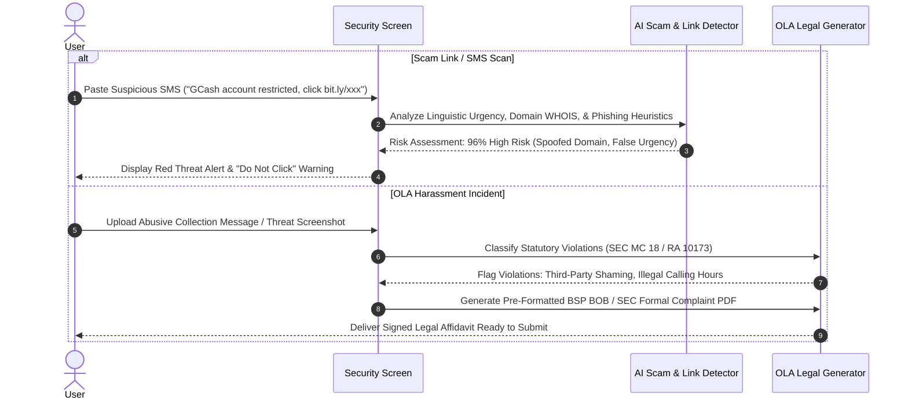

# End-to-End User Flows — Financial OS

## 1. Zero-Credential Onboarding & Baseline Setup Flow

Financial OS completely avoids asking for banking passwords or Plaid-style credentials. Onboarding is fast, friction-free, and respects privacy from minute one.

---

## 2. Universal Ambient Transaction Capture Flow

Eliminates manual entry through automated, on-device parsing of transactional artifacts.

---

## 3. Daily Safe-to-Spend & Morning Briefing Flow

---

## 4. "What-If" Purchase & Multi-Scenario Simulator Flow

---

## 5. CIEL Conversational Ingestion & Decision Advisory Flow

---

## 6. Proactive Scam Radar & OLA Harassment Shield Flow

